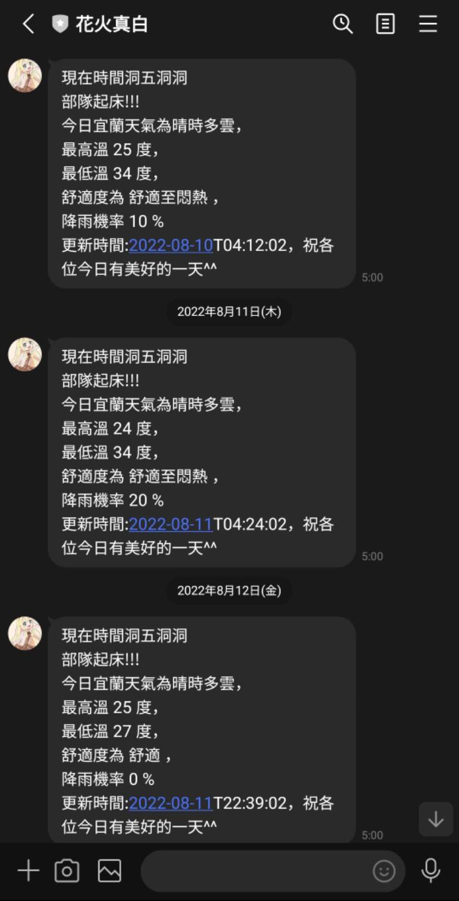
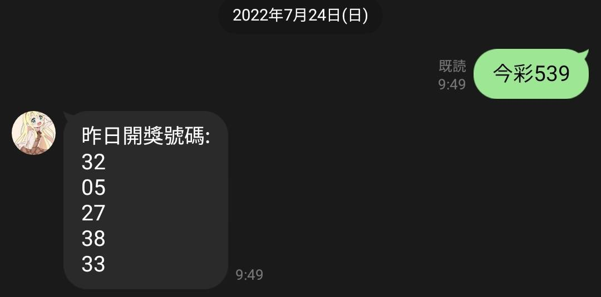
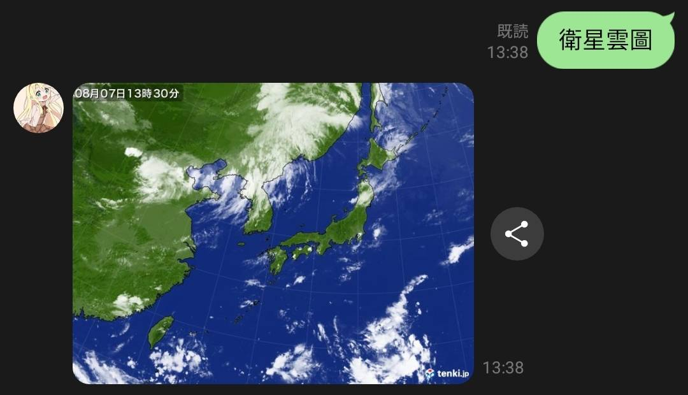
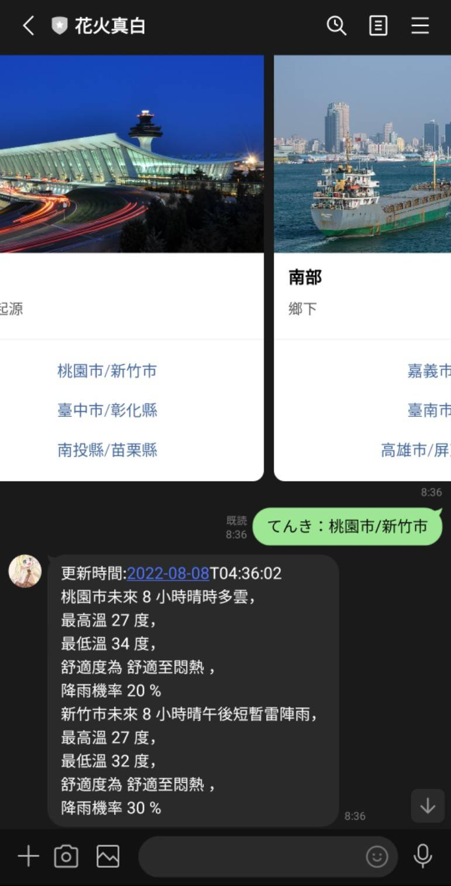
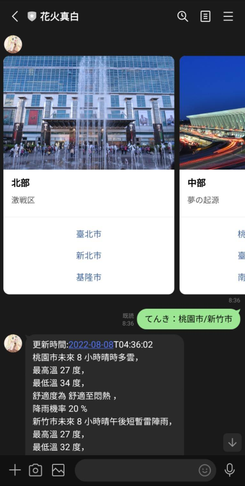

## Line 機器人
### 曾經是早上每日推播與查看天氣和抓取樂透資訊的好夥伴。

## 首先天介紹機器人每日推播功能!
## 這部分有使用到BlockingScheduler這個套件，它的功能就是在其他程式或是開發版上可以做**自動化**的功能，而因為我們需要每日推播，所以剛好可以使用該套件，這個功能就是在每天早上5點用通知聲叫醒使用者，並且依照設定的地點給出當地的天氣報告。

## >後面的天氣報告都是抓取<a href="https://opendata.cwb.gov.tw">中央氣象局</a>所提供的API。

## 第二個功能:提供最新的樂透號碼

## 第三個功能:提供最新的衛星雲圖
(來自:https://tenki.jp/)

## 第四個功能:查看當下天氣報告
### 這個部分使用了Line官方所提供的模板語法，透過官方所提供的模板可以輕鬆地做出電商機器人，讓機器人在回應時有更豐富的表現方式，而這部分是可以提供目前最新每個不同區域的氣象報告。

